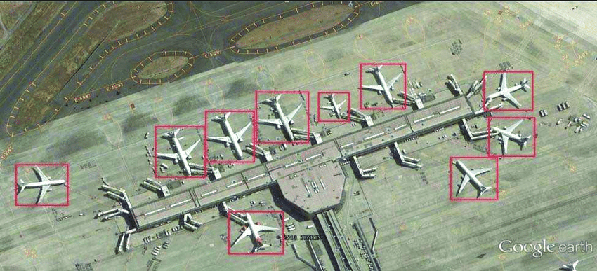

# Roboflow Aeroplane Detection API

[requirements](#requirements) | [installation](#installation) | [usage](#usage) | [roboflow-docs](#contributing)


This is a simple API for detecting aeroplanes in images using a custom Roboflow model with MS Coco model checkpoint used as the base model. The model is trained on the aeroplane dataset and can be used to detect aeroplanes in various images.

## Requirements  

#### 1. Install UV package manager:
- For Linux/MacOS:
    ```bash
    curl -LsSf https://astral.sh/uv/install.sh | sh
    ```
- For Windows:
    ```bash
    powershell -ExecutionPolicy ByPass -c "irm https://astral.sh/uv/install.ps1 | iex"
    ```

To update UV, simply run `uv self update`

#### 2. Create Roboflow API Key:

Create a Roboflow project and get your API key from there. Store it inside `.env` file as `API_KEY`. You can either use my pre-trained model or create your own model with your dataset. You can find the documentation for creating a Roboflow project [here](https://docs.roboflow.com/).


## Installation
```bash
uv sync
```
yeah, this alone command will install all required dependencies and packages for you.


## Usage  
- Download or load any image you want to detect aeroplanes in.
- Replace image path in `main.py` file with your image path.
- Run the following command:
    ```bash
    uv run main.py
    ```
- The code outputs the number of aeroplanes detected in the image.
- Feel free to play around with the code and make it your own.
